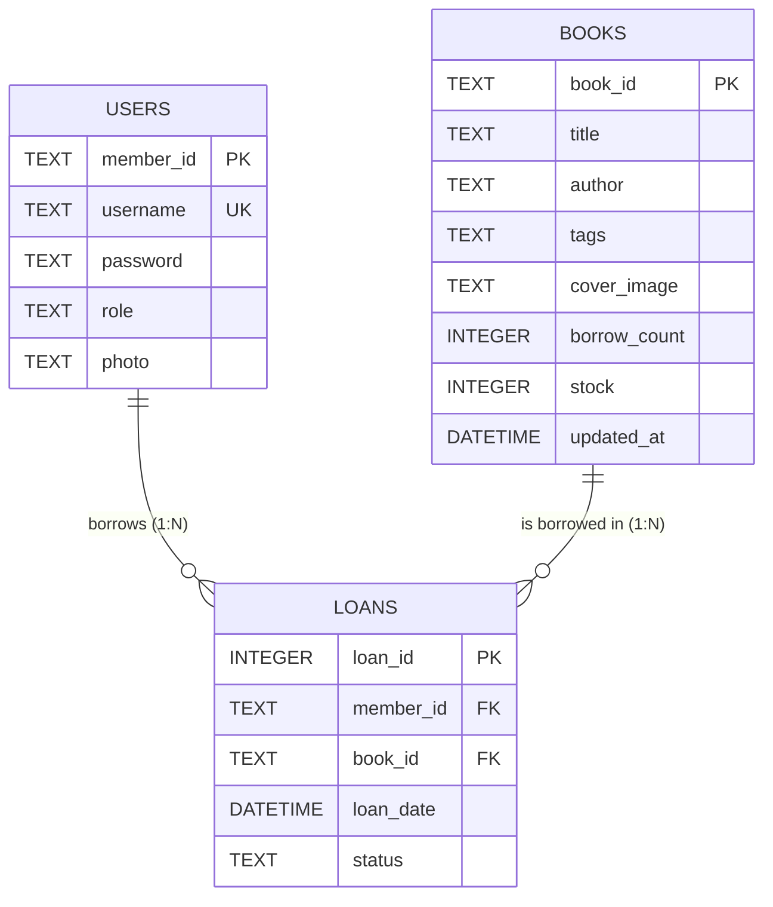

# Elysia Perpus


A modern library management system built with the Elysia.js framework and Bun runtime. This project utilizes Material Design 3 standards for the user interface.

## Installation

To install dependencies:

```bash
bun install

```

## Execution

To run the server:

```bash
bun run index.ts

```

## Features

* **Material You Interface**: Implements responsive Google Material 3 design standards.
* **AI Assistant**: Integrated **ElysiaAI** (powered by Google Gemini) for smart, conversational book recommendations and automated searching.
* **Smart Categorization**: Books are organized with tags/genres (e.g., Romance, Slice of Life) featuring interactive quick-filter MD3 chips.
* **Profile Management**: Users can upload and crop profile pictures directly within the application.
* **Admin Dashboard**: Tools for monitoring system statistics, managing user lists, and adding book collections.
* **Book Tracking**: Every book added is automatically assigned a structured unique identifier (e.g., EP-10001).
* **Security**: Equipped with Security Headers (HSTS, CSP) and JWT-based authentication.
* **Database**: Utilizes SQLite with WAL (Write-Ahead Logging) mode for real-time data consistency.

## Tech Stack

* **Runtime**: Bun v1.3.13
* **Framework**: Elysia.js
* **Database**: SQLite (via bun:sqlite)
* **UI Library**: Material Web Components and Material Symbols
* **AI Provider**: Google Generative AI (Gemini)
* **Imaging**: Cropper.js

## Directory Structure

* `index.ts`: Main backend logic, AI integration, and database configuration.
* `public/`: Frontend assets including index.html, login.html, and register.html.
* `database/`: Directory for SQLite database files.
* `public/uploads/`: Storage for user profile pictures.
* `public/covers/`: Storage for book cover images.

## Application Flow

Below is the logical flow of the application from user authentication to action execution.

<svg xmlns="[http://www.w3.org/2000/svg](http://www.w3.org/2000/svg)" viewBox="0 0 1350 1020" width="100%" height="100%">
  <defs>
    <marker id="arrow" viewBox="0 0 10 10" refX="5" refY="5" markerWidth="6" markerHeight="6" orient="auto-start-reverse">
      <path d="M 0 0 L 10 5 L 0 10 z" fill="#6750a4" />
    </marker>
    <style>
      text { font-family: 'Roboto', 'Segoe UI', Tahoma, sans-serif; font-size: 14px; fill: #1d192b; pointer-events: none; }
      .node { fill: #f3edf7; stroke: #6750a4; stroke-width: 2px; }
      .startend { fill: #6750a4; stroke: none; }
      .decision { fill: #e8def8; stroke: #6750a4; stroke-width: 2px; }
      .db { fill: #fff; stroke: #6750a4; stroke-width: 2px; stroke-dasharray: 4; }
      .line { stroke: #6750a4; stroke-width: 2px; fill: none; stroke-linejoin: round; }
      .label { font-size: 13px; fill: #49454f; font-weight: bold; background: white;}
    </style>
  </defs>

  <rect x="570" y="30" width="160" height="40" rx="20" class="startend" />
  <text x="650" y="55" fill="white" text-anchor="middle" font-weight="bold">Start</text>
  
  <path d="M 650 70 L 650 110" class="line" marker-end="url(#arrow)" />

  <polygon points="550,110 750,110 730,160 530,160" class="decision" />
  <text x="650" y="140" text-anchor="middle">Input: Login Credentials</text>
  
  <path d="M 650 160 L 650 200" class="line" marker-end="url(#arrow)" />

  <polygon points="650,200 750,250 650,300 550,250" class="decision" />
  <text x="650" y="255" text-anchor="middle" font-weight="bold">Valid Login?</text>

  <path d="M 550 250 L 480 250 L 480 135 L 520 135" class="line" marker-end="url(#arrow)" />
  <rect x="490" y="235" width="40" height="20" fill="white" rx="4" />
  <text x="510" y="250" class="label" text-anchor="middle">No</text>

  <path d="M 650 300 L 650 340" class="line" marker-end="url(#arrow)" />
  <rect x="635" y="305" width="40" height="20" fill="white" rx="4" />
  <text x="655" y="320" class="label" text-anchor="middle">Yes</text>

  <polygon points="650,340 750,390 650,440 550,390" class="decision" />
  <text x="650" y="395" text-anchor="middle" font-weight="bold">Role == Admin?</text>


  <path d="M 550 390 L 300 390 L 300 440" class="line" marker-end="url(#arrow)" />
  <rect x="420" y="375" width="90" height="20" fill="white" rx="4" />
  <text x="465" y="390" class="label" text-anchor="middle">Yes (Admin)</text>

  <rect x="200" y="440" width="200" height="50" rx="8" class="node" />
  <text x="300" y="470" text-anchor="middle">Admin Dashboard</text>
  
  <path d="M 300 490 L 300 530" class="line" marker-end="url(#arrow)" />

  <polygon points="300,530 380,580 300,630 220,580" class="decision" />
  <text x="300" y="585" text-anchor="middle" font-weight="bold">Logout?</text>

  <path d="M 380 580 L 650 580 L 650 940" class="line" />
  <rect x="410" y="565" width="40" height="20" fill="white" rx="4" />
  <text x="430" y="580" class="label" text-anchor="middle">Yes</text>

  <path d="M 300 630 L 300 670" class="line" marker-end="url(#arrow)" />
  <rect x="275" y="635" width="30" height="20" fill="white" rx="4" />
  <text x="290" y="650" class="label" text-anchor="middle">No</text>

  <rect x="180" y="670" width="240" height="50" rx="8" class="node" />
  <text x="300" y="695" text-anchor="middle">Add Book / Manage Users</text>
  <text x="300" y="712" text-anchor="middle" font-size="11px" fill="#49454f">(Includes Tags/Genre Parsing)</text>

  <path d="M 300 720 L 300 760" class="line" marker-end="url(#arrow)" />

  <rect x="210" y="760" width="180" height="50" rx="25" class="db" />
  <text x="300" y="790" text-anchor="middle">SQLite: Write Data</text>

  <path d="M 300 810 L 300 860 L 100 860 L 100 410 L 260 410 L 260 440" class="line" marker-end="url(#arrow)" />


  <path d="M 750 390 L 1000 390 L 1000 440" class="line" marker-end="url(#arrow)" />
  <rect x="795" y="375" width="100" height="20" fill="white" rx="4" />
  <text x="845" y="390" class="label" text-anchor="middle">No (Member)</text>

  <rect x="900" y="440" width="200" height="50" rx="8" class="node" />
  <text x="1000" y="470" text-anchor="middle">Member Dashboard</text>
  
  <path d="M 1000 490 L 1000 530" class="line" marker-end="url(#arrow)" />

  <polygon points="1000,530 1080,580 1000,630 920,580" class="decision" />
  <text x="1000" y="585" text-anchor="middle" font-weight="bold">Logout?</text>

  <path d="M 920 580 L 650 580" class="line" />
  <rect x="850" y="565" width="40" height="20" fill="white" rx="4" />
  <text x="870" y="580" class="label" text-anchor="middle">Yes</text>

  <path d="M 1000 630 L 1000 670" class="line" marker-end="url(#arrow)" />
  <rect x="975" y="635" width="30" height="20" fill="white" rx="4" />
  <text x="990" y="650" class="label" text-anchor="middle">No</text>

  <polygon points="1000,670 1100,720 1000,770 900,720" class="decision" />
  <text x="1000" y="725" text-anchor="middle" font-weight="bold">Action Type?</text>

  <path d="M 900 720 L 830 720 L 830 760" class="line" marker-end="url(#arrow)" />
  <rect x="840" y="705" width="55" height="20" fill="white" rx="4" />
  <text x="865" y="720" class="label" text-anchor="middle">Filter/AI</text>

  <rect x="730" y="760" width="200" height="50" rx="8" class="node" />
  <text x="830" y="785" text-anchor="middle">ElysiaAI / Click Genre Tag</text>
  <text x="830" y="802" text-anchor="middle" font-size="11px" fill="#49454f">(Dynamic Sorting)</text>

  <path d="M 1100 720 L 1170 720 L 1170 760" class="line" marker-end="url(#arrow)" />
  <rect x="1110" y="705" width="55" height="20" fill="white" rx="4" />
  <text x="1135" y="720" class="label" text-anchor="middle">Borrow</text>

  <rect x="1070" y="760" width="200" height="50" rx="8" class="node" />
  <text x="1170" y="790" text-anchor="middle">Process Book Loan</text>

  <path d="M 830 810 L 830 840 L 1000 840 L 1000 860" class="line" />
  <path d="M 1170 810 L 1170 840 L 1000 840" class="line" />
  <path d="M 1000 840 L 1000 860" class="line" marker-end="url(#arrow)" />

  <rect x="910" y="860" width="180" height="50" rx="25" class="db" />
  <text x="1000" y="890" text-anchor="middle">SQLite: Query/Update</text>

  <path d="M 1000 910 L 1000 960 L 1300 960 L 1300 410 L 1050 410 L 1050 440" class="line" marker-end="url(#arrow)" />


  <path d="M 650 940 L 650 970" class="line" marker-end="url(#arrow)" />

  <rect x="570" y="970" width="160" height="40" rx="20" class="startend" />
  <text x="650" y="995" fill="white" text-anchor="middle" font-weight="bold">End (Destroy Session)</text>
</svg>

## Database Architecture & ERD

The database is built using SQLite with Write-Ahead Logging (WAL) mode enabled for concurrent read/write operations. The system consists of three main tables: users, books, and loans.

### Entity Relationship Diagram



### Data Dictionary

#### Table: users

Stores all account information for both administrators and regular library members.

| Column Name | Data Type | Constraints | Default Value | Description |
| --- | --- | --- | --- | --- |
| member_id | TEXT | Primary Key | - | Unique generated identifier (e.g., M-1234). |
| username | TEXT | Unique, Not Null | - | User's login identification. |
| password | TEXT | Not Null | - | Bcrypt hashed password. |
| role | TEXT | - | 'member' | Defines access level ('admin' or 'member'). |
| photo | TEXT | - | '' (Empty String) | Relative URL path to the user's uploaded profile picture. |

#### Table: books

Contains the library's book catalog and current availability statistics.

| Column Name | Data Type | Constraints | Default Value | Description |
| --- | --- | --- | --- | --- |
| book_id | TEXT | Primary Key | - | Unique generated serial number (e.g., EP-10001). |
| title | TEXT | Not Null | - | Title of the book. |
| author | TEXT | Not Null | - | Author of the book. |
| tags | TEXT | - | '' (Empty String) | Comma-separated list of genres/tags (e.g., Romance, Education). |
| cover_image | TEXT | - | '' (Empty String) | Relative URL path to the book's cover image. |
| borrow_count | INTEGER | - | 0 | Total number of times the book has been borrowed. |
| stock | INTEGER | - | 1 | Current available physical stock for borrowing. |
| updated_at | DATETIME | - | CURRENT_TIMESTAMP | Timestamp of the last metadata update or stock change. |

#### Table: loans

A transactional junction table that records the borrowing activities between users and books.

| Column Name | Data Type | Constraints | Default Value | Description |
| --- | --- | --- | --- | --- |
| loan_id | INTEGER | Primary Key | AUTOINCREMENT | Unique sequential identifier for the transaction. |
| member_id | TEXT | Foreign Key | - | References users.member_id. |
| book_id | TEXT | Foreign Key | - | References books.book_id. |
| loan_date | DATETIME | - | CURRENT_TIMESTAMP | The exact date and time the loan was created. |
| status | TEXT | - | 'PINJAM' | Current state of the loan ('PINJAM' or 'KEMBALI'). |

---

This project was created using `bun init` in Bun v1.3.13. Bun is a fast all-in-one JavaScript runtime.