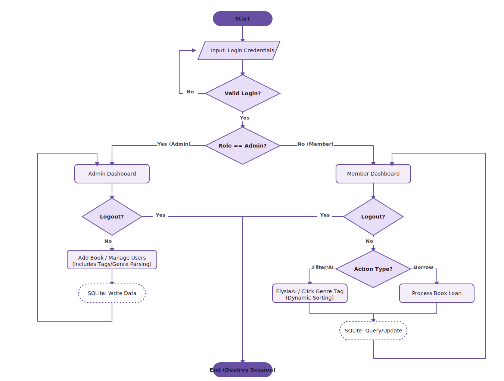
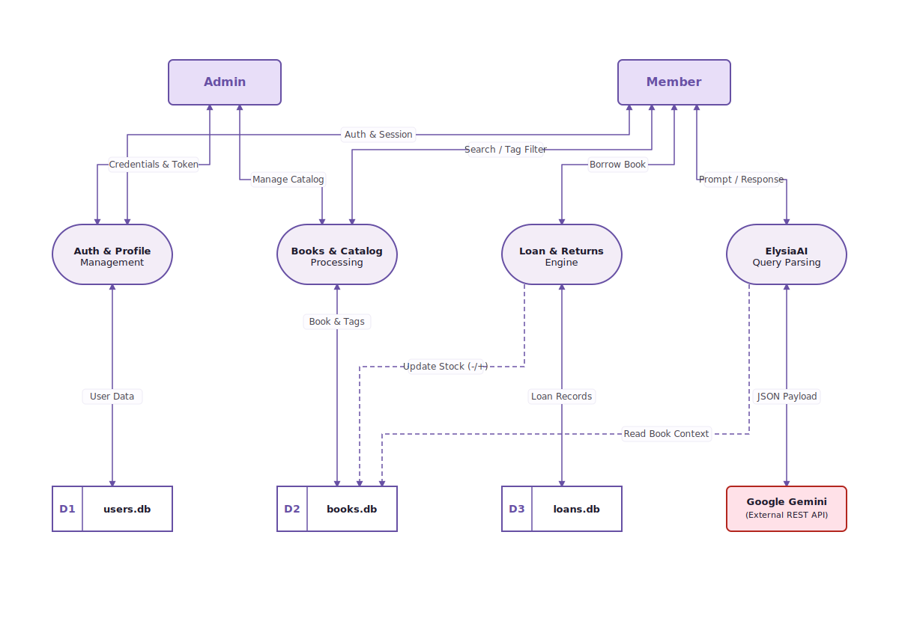
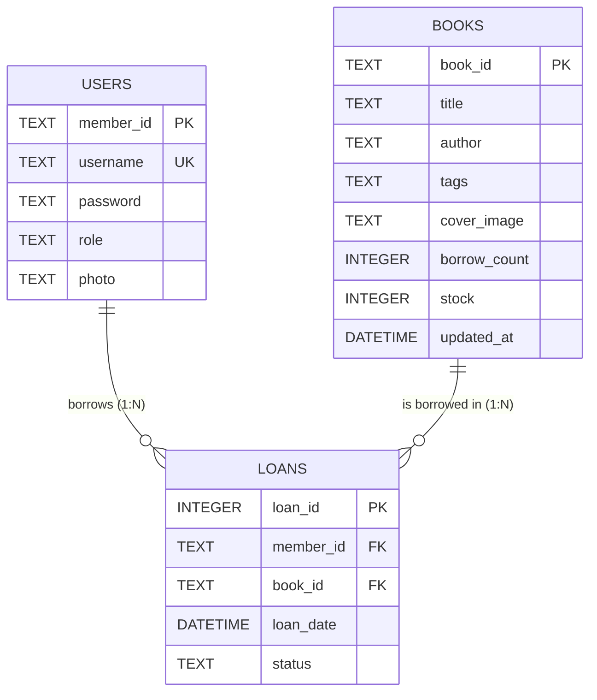

# Elysia Perpus


A modern library management system built with the Elysia.js framework and Bun runtime. This project utilizes Material Design 3 standards for the user interface.

## Installation

To install dependencies:

```bash
bun install

```

## Configuration

Create a `.env` file in the root directory of the project. You can use the following template:

```env
# JWT Secret Key
# Use a long, random string for security in production.
JWT_SECRET=your_super_secret_jwt_key_here

# Default Admin Setup
# Used to generate the first admin account when the database is empty.
ADMIN_USERNAME=admin
ADMIN_PASSWORD=admin123

# Artificial Intelligence Credentials
GEMINI_API_KEY=your_gemini_api_key_here
```

## Execution

To run the server:

```bash
bun run index.ts

```

## Features

* **Material You Interface**: Implements responsive Google Material 3 design standards.
* **AI Assistant**: Integrated **ElysiaAI** (powered by Google Gemini) for smart, conversational book recommendations and automated searching.
* **Smart Categorization**: Books are organized with tags/genres (e.g., Romance, Slice of Life) featuring interactive quick-filter MD3 chips.
* **Profile Management**: Users can upload and crop profile pictures directly within the application.
* **Admin Dashboard**: Tools for monitoring system statistics, managing user lists, and adding book collections.
* **Book Tracking**: Every book added is automatically assigned a structured unique identifier (e.g., EP-10001).
* **Security**: Equipped with Security Headers (HSTS, CSP) and JWT-based authentication.
* **Database**: Utilizes SQLite with WAL (Write-Ahead Logging) mode for real-time data consistency.

## Tech Stack

* **Runtime**: Bun v1.3.13
* **Framework**: Elysia.js
* **Database**: SQLite (via bun:sqlite)
* **UI Library**: Material Web Components and Material Symbols
* **AI Provider**: Google Generative AI (Gemini)
* **Imaging**: Cropper.js

## API Endpoints

| Method | Endpoint | Description |
| :--- | :--- | :--- |
| `POST` | `/api/register` | Register a new member account |
| `POST` | `/api/login` | Login and set JWT session |
| `POST` | `/api/logout` | Logout and destroy session |
| `GET` | `/api/user/:id` | Get user profile data |
| `POST` | `/api/upload-photo` | Upload/update profile picture |
| `GET` | `/api/books/latest` | Retrieve list of all books |
| `GET` | `/api/books/search` | Search books by query parameters |
| `POST` | `/api/pinjam` | Process book loan |
| `POST` | `/api/kembali` | Process book return and fine calculation |
| `GET` | `/api/my-loans/:id` | Retrieve active loan history |
| `POST` | `/api/ask-elysia` | Get AI-powered book recommendations |
| `GET` | `/api/admin/stats` | System statistics and chart data |
| `GET` | `/api/admin/backup` | Backup database and assets (.zip) |
| `POST` | `/api/admin/restore` | Restore database from .sql file |
| `POST` | `/api/admin/books` | Add a new book |
| `DELETE` | `/api/admin/books/:id` | Delete book, cover, and related history |
| `GET` | `/api/admin/users` | List all system users |
| `POST` | `/api/admin/users/:id/password` | Reset user password |
| `DELETE` | `/api/admin/users/:id` | Delete a user |
| `POST` | `/api/admin/loans/:id/simulate-time` | Time simulation (for debugging or setting user borrow time) |

## Directory Structure

* `index.ts`: Main backend logic, AI integration, and database configuration.
* `public/`: Frontend assets including index.html, login.html, and register.html.
* `database/`: Directory for SQLite database files.
* `public/uploads/`: Storage for user profile pictures.
* `public/covers/`: Storage for book cover images.

## Application Flow

Below is the logical flow of the application from user authentication to action execution.

<p align="center">
  
</p>

## System Architecture

This system utilizes a modular architecture, handling user authentication, catalog management, and AI processing seamlessly.

### Data Flow Diagram

Below is the Data Flow Diagram illustrating how information moves between users (Admin/Member), core system processes, the external Google Gemini API, and the internal SQLite data stores.

<p align="center">
  
</p>

### Entity Relationship Diagram



### Data Dictionary

#### Table: `users`

Stores all account information for both administrators and regular library members.

| Column Name | Data Type | Constraints | Default Value | Description |
| --- | --- | --- | --- | --- |
| `member_id` | TEXT | Primary Key | - | Unique generated identifier (e.g., M-1234). |
| `username` | TEXT | Unique, Not Null | - | User's login identification. |
| `password` | TEXT | Not Null | - | Bcrypt hashed password. |
| `role` | TEXT | - | member | Defines access level ('admin' or 'member'). |
| `photo` | TEXT | - | (Empty String) | Relative URL path to the user's uploaded profile picture. |

#### Table: `books`

Contains the library's book catalog, genre classifications, and current availability statistics.

| Column Name | Data Type | Constraints | Default Value | Description |
| --- | --- | --- | --- | --- |
| `book_id` | TEXT | Primary Key | - | Unique generated serial number (e.g., EP-10001). |
| `title` | TEXT | Not Null | - | Title of the book. |
| `author` | TEXT | Not Null | - | Author of the book. |
| `tags` | TEXT | - | (Empty String) | Comma-separated list of genres/tags (e.g., Romance, Education). |
| `cover_image` | TEXT | - | (Empty String) | Relative URL path to the book's cover image. |
| `borrow_count` | INTEGER | - | 0 | Total number of times the book has been borrowed. |
| `stock` | INTEGER | - | 1 | Current available physical stock for borrowing. |
| `updated_at` | DATETIME | - | CURRENT_TIMESTAMP | Timestamp of the last metadata update or stock change. |

#### Table: `loans`

A transactional junction table that records the borrowing activities between users and books.

| Column Name | Data Type | Constraints | Default Value | Description |
| --- | --- | --- | --- | --- |
| `loan_id` | INTEGER | Primary Key | AUTOINCREMENT | Unique sequential identifier for the transaction. |
| `member_id` | TEXT | Foreign Key | - | References `users.member_id`. |
| `book_id` | TEXT | Foreign Key | - | References `books.book_id`. |
| `loan_date` | DATETIME | - | CURRENT_TIMESTAMP | The exact date and time the loan was created. |
| `status` | TEXT | - | PINJAM | Current state of the loan ('PINJAM' or 'KEMBALI'). |

---

This project was created using `bun init` in Bun v1.3.13. Bun is a fast all-in-one JavaScript runtime.